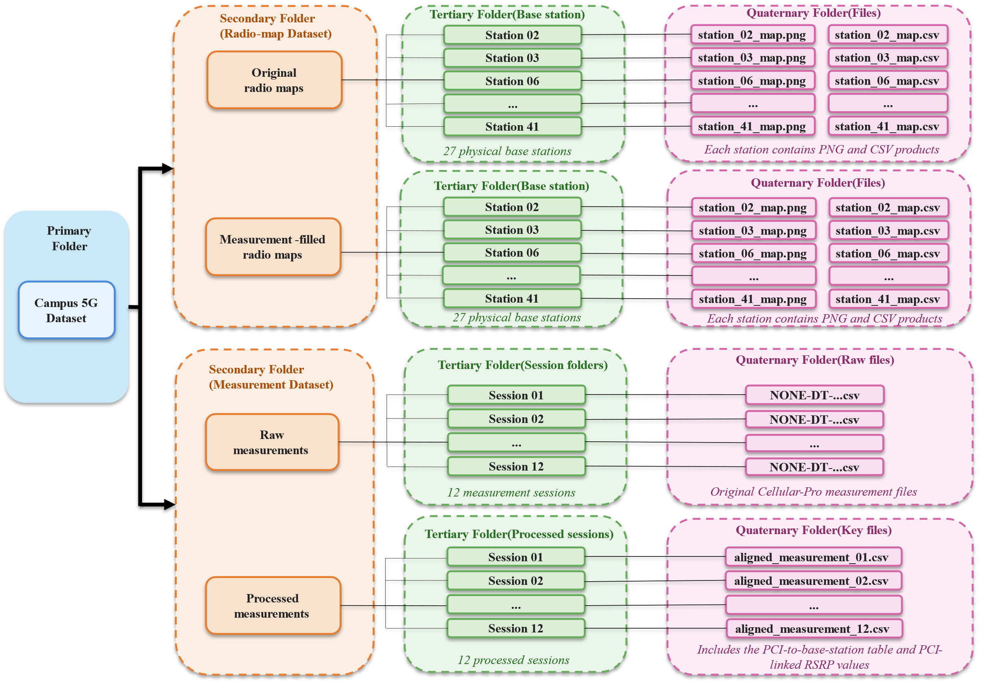
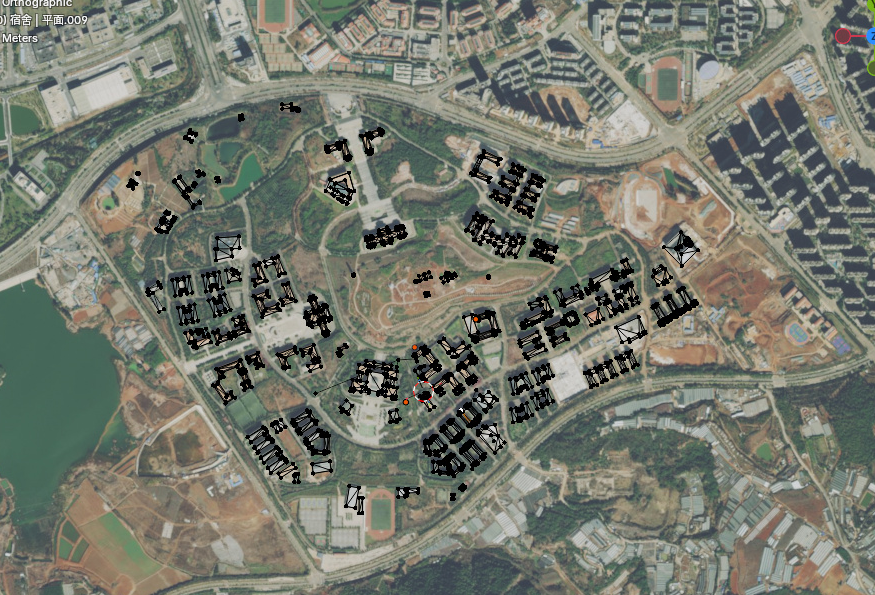
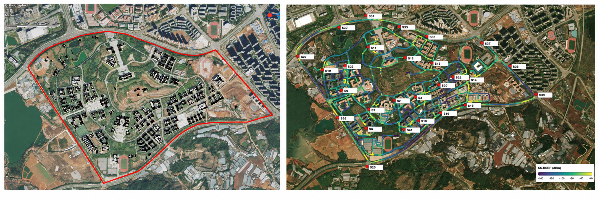
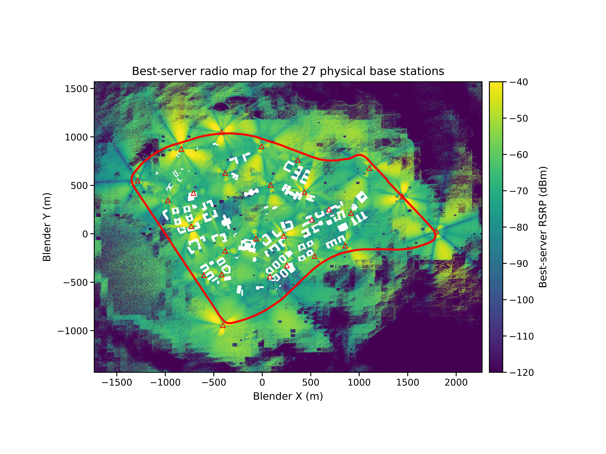
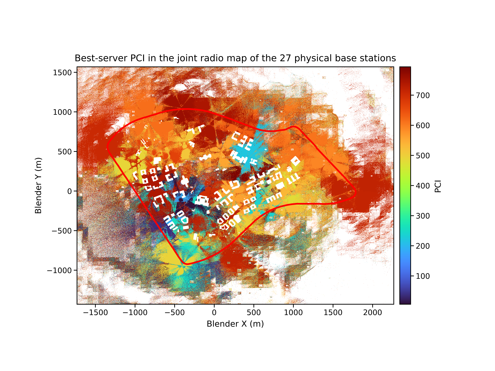
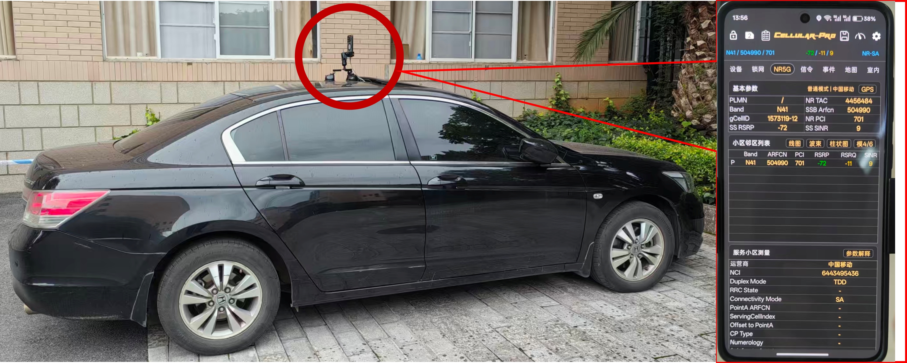
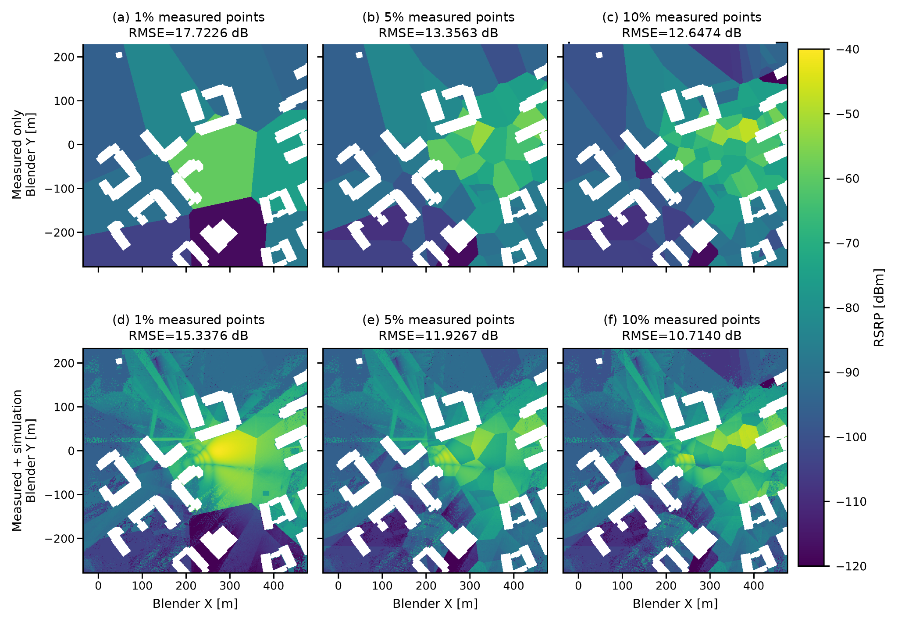

# Campus-Scale 5G NR Radio Propagation Dataset

Companion code for the Data in Brief article:

> **A Campus-Scale 5G NR Radio Propagation Dataset Integrating Drive-Test Measurements, 3D Environmental Geometry, and Ray Tracing**

This repository provides the processing, ray-tracing, evaluation, localization, reconstruction, and visualization workflows associated with a campus-scale 5G NR radio propagation dataset collected at the Chenggong Campus of Yunnan University, Kunming, China.

The repository is intended to support reproducible use of the released dataset and the application examples reported in the article. The large measurement files, generated radio maps, and other publication data products should be obtained from the archival dataset repository referenced by the article.

---

## Overview

The dataset combines road measurements, a common 3D spatial environment, physical base-station information, and Sionna RT propagation products in the same coordinate system.

The released data include:

- 12 vehicle-based 5G NR drive-test sessions;
- 14,355 raw measurement records;
- a digital elevation model (DEM) and 3D building geometry;
- 27 field-verified physical base stations;
- 79 Physical Cell Identifiers (PCIs);
- calibrated Sionna RT propagation products;
- per-station 512 m × 512 m radio maps with 1 m horizontal resolution;
- a 4000 m × 3000 m joint best-server radio map with 1 m horizontal resolution;
- 10,383 co-located measurement–simulation grid samples;
- application examples for physical base-station localization and sparse radio-map reconstruction.

### Dataset organization



**Figure 1.** Dataset storage structure used in the companion article.

### Study environment



**Figure 2.** Spatial distribution of the campus 3D terrain and building scene.



**Figure 3.** Twelve drive-test trajectories, measured signal distribution, and locations of the 27 physical base stations.

---

## Data summary

| Item | Description |
|---|---|
| Study area | Chenggong Campus, Yunnan University, Kunming, China |
| Measurement sessions | 12 vehicle-based drive tests |
| Raw measurement records | 14,355 |
| Network | China Mobile 5G NR n41 |
| Center ARFCN | 513000 |
| SSB ARFCN | 504990 |
| Center frequency | 2.565 GHz |
| Channel bandwidth | 100 MHz |
| Receiver height | approximately 1.5 m above local ground |
| Physical base stations | 27 |
| PCIs | 79 |
| 3D environment | DEM and main campus buildings |
| Coordinate workflow | WGS84 → EPSG:3857 → local Blender metric coordinates |
| Per-station radio maps | 512 m × 512 m, 1 m grid |
| Joint best-server radio map | 4000 m × 3000 m, 1 m grid |
| Co-located measurement–simulation samples | 10,383 |
| Main propagation quantity | RSRP |
| Ray-tracing platform | Sionna RT |

Physical base station 22 is treated as a single-PCI omnidirectional station with PCI 800. The remaining stations use the field-verified PCI/site associations provided with the repository configuration files.

---

## Repository scope

This GitHub repository contains the code needed to reproduce the main processing and application workflows described in the article:

- measurement coordinate alignment;
- multi-PCI measurement expansion;
- measurement preprocessing and aggregation;
- Sionna RT scene preparation;
- base-station parameter calibration;
- per-station radio-map generation;
- joint best-server radio-map generation;
- measurement–simulation matching and evaluation;
- physical base-station localization;
- radio-map reconstruction;
- publication-oriented visualization;
- automated tests.

The complete published dataset should be downloaded separately from the archival repository associated with the article.

---

## Repository structure

```text
.
├── run_pipeline.py
├── check_project_layout.py
├── environment.yml
├── requirements.txt
├── README.md
├── assets/
│   ├── ground.ply
│   └── ynu_chenggong_campus-001.ply
├── config/
│   ├── base_station_pci_mapping.csv
│   ├── station_catalog_27stations.csv
│   └── coordinate_alignment.json
├── workflows/
│   ├── preprocessing/
│   ├── parameter_calibration/
│   ├── radio_map/
│   ├── evaluation/
│   ├── localization/
│   ├── reconstruction/
│   └── visualization/
├── tests/
├── tools/
├── scripts/
├── data/
└── outputs/
```

`run_pipeline.py` is the recommended entry point for the complete workflow.

---

## Data placement

After downloading the archived dataset, place the required files under the repository root using the following code-facing structure:

```text
data/
├── raw_measurements/
│   └── *.csv
├── aligned_measurements/
│   └── *_with_blender_xyz.csv
└── processed/
    ├── cell_pci_rsrp_long_27stations.csv
    ├── cell_pci_rsrp_1m_calibration.csv
    └── cell_pci_rsrp_2p77m_localization.csv
```

The exact public archive may use publication-facing directory names. In that case, copy or link the corresponding archived files into the paths above before running the code.

Generated products are written under:

```text
outputs/
```

---

## Software environment

### Recommended setup

- Windows 10/11
- Python 3.10
- Miniconda or Anaconda
- NVIDIA GPU for full Sionna RT calculations
- Sionna 1.2.2

Create the environment:

```bash
conda env create -f environment.yml
conda activate sionna_env
```

Alternatively:

```bash
python -m pip install -r requirements.txt
python -m pip install sionna==1.2.2
```

Verify the core environment:

```bash
python -c "import numpy, pandas, scipy, trimesh, pyproj, sionna; print('Environment OK')"
```

---

## Project check

Run:

```bash
python run_pipeline.py --help
python run_pipeline.py check
```

The project checker verifies the scene meshes, station catalog, base-station/PCI mapping, coordinate-alignment metadata, measurement-data availability, processed-table schemas, and generated downstream products.

---

## Processing workflow

The main processing sequence is:

```text
Raw Cellular-Pro CSV files
        |
        v
Coordinate alignment
WGS84 -> EPSG:3857 -> local Blender coordinates
        |
        v
Multi-PCI / RSRP expansion
        |
        v
Processed measurement tables
        |
        +------------------------------+
        |                              |
        v                              v
Base-station parameter            Measurement analysis
calibration with Sionna RT
        |
        v
Per-station propagation products
        |
        +------------------------------+
        |                              |
        v                              v
Per-station radio maps       Joint best-server radio map
                                      |
                                      v
                         Measurement-simulation matching
                                      |
                         +------------+------------+
                         |                         |
                         v                         v
               Base-station localization   Radio-map reconstruction
```

---

## Measurement preprocessing

If the archived dataset already contains the processed tables, this stage can be skipped.

Rebuild the preprocessing products with:

```bash
python run_pipeline.py prepare-data
```

Force regeneration:

```bash
python run_pipeline.py prepare-data --force
```

Individual stages can also be run separately:

```bash
python run_pipeline.py align
python run_pipeline.py extract
python run_pipeline.py preprocess
```

The processing workflow includes coordinate conversion, terrain-height lookup, receiver-height assignment, multi-PCI/RSRP expansion, physical base-station association, and generation of analysis-ready measurement tables.

---

## Base-station parameter calibration

Physical base-station locations and PCI associations are based on field verification. Transmitter parameters that were not directly available are calibrated against road-measured RSRP.

Quick check for one station:

```bash
python run_pipeline.py calibrate --stations 3 --quick
```

Run the calibration workflow for all physical base stations:

```bash
python run_pipeline.py calibrate --stations all
```

The calibration configuration is stored in:

```text
workflows/parameter_calibration/config.yaml
```

The calibration workflow uses the common DEM/building scene, the measured receiver coordinates, and PCI-specific measured RSRP.

---

## Per-station radio maps

Generate per-station radio maps from the calibrated propagation parameters:

```bash
python run_pipeline.py export-dem --stations all
```

Compare the terrain-following receiver-surface workflow with the fixed-height Z-plane workflow:

```bash
python run_pipeline.py compare-surfaces --stations all --methods both
```

The principal per-station products use a 512 m × 512 m region and a 1 m horizontal grid.

---

## Joint best-server radio map

The network-scale radio map covers 4000 m × 3000 m with a 1 m horizontal grid.



**Figure 4.** Joint best-server radio map for the 27 physical base stations.



**Figure 5.** Spatial distribution of the best-server PCI in the joint radio map.

Check the job configuration:

```bash
python run_pipeline.py export-joint-map --dry-run
```

Quick validation:

```bash
python run_pipeline.py export-joint-map --quick
```

Full generation:

```bash
python run_pipeline.py export-joint-map
```

For each valid grid cell, the workflow records the maximum RSRP among the candidate PCIs and the associated PCI, physical base-station identifier, and sector index.

---

## Measurement–simulation matching

Evaluate co-located measurement and simulation samples with:

```bash
python run_pipeline.py compare-joint-map
```

The article reports 10,383 co-located grid samples with valid measured and simulated RSRP.

Measurement and simulation values are compared only after spatial co-location in the common coordinate system.

---

## Measurement setup



**Figure 6.** External mounting of the 5G NR measurement terminal on the vehicle roof and the Cellular-Pro acquisition interface.

The measurement terminal was externally mounted on the vehicle roof, with the receiver approximately 1.5 m above the local ground during the drive tests.

---

## Application example: physical base-station localization

The localization application compares two branches using the same selected receiver locations.

### Measurement-only

This branch uses:

- selected measured receiver coordinates;
- corresponding measured PCI–RSRP observations.

Physical base-station reference coordinates are not used during candidate generation or scoring.

### Measurement–simulation

This branch uses the same selected receiver coordinates and measured PCI–RSRP observations, together with co-located PCI-specific RSRP sampled from pre-generated Sionna RT maps.

Physical base-station truth is used only after the final estimate has been produced to calculate localization error.

Run the 10–15 receiver-location experiment:

```bash
python run_pipeline.py localize-sweep \
    --point-counts 10,11,12,13,14,15 \
    --random-trials 10
```

A single receiver-location count can also be evaluated:

```bash
python run_pipeline.py localize \
    --points-per-station 10 \
    --random-trials 10
```

The formal comparison output is written under:

```text
outputs/localization_two_branch_rmse_only/
```

The main localization metric is the root-mean-square error of the estimated physical base-station positions.

---

## Application example: radio-map reconstruction

The reconstruction example uses physical base station 3, PCI 558, in a 512 m × 512 m region with a 1 m grid.



**Figure 8.** Measurement-only nearest-neighbor reconstruction and measurement–simulation reconstruction at measured sampling ratios of 1%, 5%, and 10%.

Run:

```bash
python run_pipeline.py reconstruct \
    --station-id 3 \
    --pci 558 \
    --simulation-mode compare
```

### Measurement-only reconstruction

The selected measured points are assigned over the valid outdoor grid using 1-nearest-neighbor (1-NN) reconstruction.

### Measurement–simulation reconstruction

The same selected measured points are combined with a fixed Sionna RT radio map. The selected co-located measurement–simulation pairs are used to align the simulation values, after which the measurement–simulation residuals are reconstructed by 1-NN assignment. Where the simulation map is invalid, the method falls back to the measurement-only prediction.

### Progressive sampling

The sampling sets are constructed progressively from 1% to 10% of the available measured points. The selection procedure uses the geometry of the valid domain and measurements that have already been acquired. It does not use the final reconstruction RMSE as a selection criterion.

Each sampling percentage generates one reconstructed map for each branch.

### Reconstruction evaluation

The primary RMSE is calculated over all finite outdoor cells in the common 512 m × 512 m reference domain.

The plotting interval and quantitative evaluation are treated separately. Display limits are used for visualization only.

The principal outputs are written under:

```text
outputs/radio_map_reconstruction_nn_fullgrid_two_branch/
```

Typical outputs include:

```text
station_03_pci_558/
├── percent_01/
├── ...
├── percent_10/
├── reconstruction_single_run_metrics.csv
├── reconstruction_simulation_ablation_comparison.csv
├── reconstruction_full_grid_evaluation_audit.csv
├── reconstruction_trend_audit.md
├── reconstruction_simulation_ablation_rmse.png
└── reconstruction_maps_1_5_10.png
```

---

## Visualization

Generate measurement figures:

```bash
python run_pipeline.py visualize-measurements
```

Generate the output-structure figure:

```bash
python run_pipeline.py plot-output-structure
```

Generate the complete dataset visualization set:

```bash
python run_pipeline.py visualize-dataset
```

---

## Tests

Run the full test suite:

```bash
python run_pipeline.py test
```

or:

```bash
python -m pytest tests
```

The tests cover coordinate utilities, measurement parsing, calibration-related behavior, localization workflows, sampling logic, simulation-data ablation, reconstruction protocols, and publication-figure generation.

---

## Reproducibility notes

For reproducible use of the repository:

1. Use the same measured receiver locations for paired Measurement-only and Measurement–simulation comparisons.
2. Do not use physical base-station truth during localization candidate generation or scoring.
3. Do not use the final reconstruction RMSE as a sample-selection criterion.
4. Use the complete valid outdoor evaluation domain for the formal reconstruction RMSE.
5. Keep plotting ranges separate from quantitative evaluation.
6. Record the Git commit, random seed, command line, software environment, and Sionna configuration used for reported results.
7. Keep generated outputs from different experimental configurations in separate directories.
8. Archive the exact source snapshot associated with the published data article.

---

## Computational considerations

The most computationally demanding stages are:

- calibration of all physical base stations;
- high-sample Sionna RT calculations;
- per-station 1 m radio-map generation;
- generation of the 4000 m × 3000 m joint best-server radio map;
- repeated localization experiments;
- high-resolution publication figures.

Use quick or dry-run modes before launching full simulations:

```bash
python run_pipeline.py calibrate --stations 3 --quick
python run_pipeline.py export-joint-map --dry-run
python run_pipeline.py export-joint-map --quick
```

---

## Limitations

The 3D propagation scene primarily represents terrain and the main campus buildings. Vegetation, vehicles, pedestrians, and other transient or small-scale environmental objects are not explicitly modeled.

The physical base-station locations and PCI associations were field verified, while transmitter parameters that were not directly available were calibrated using the measured RSRP.

The localization and reconstruction workflows are application examples for demonstrating reuse of the released data and are not intended to represent optimal algorithms for all environments.

---

## Data and code availability

### Dataset

The complete public dataset should be cited and downloaded from the permanent archival repository reported in the article.

- **Dataset repository:** [add permanent repository name]
- **Dataset DOI:** [add dataset DOI]
- **Dataset URL:** [add permanent dataset URL]

### Article

- **Journal:** Data in Brief
- **Article DOI:** [add article DOI after publication]

### Source code

This GitHub repository contains the code companion to the archived dataset.

- **Repository URL:** [add GitHub repository URL]

Replace the bracketed publication metadata after the permanent records have been assigned.

---

## Citation

If you use the dataset, please cite the Data in Brief article:

```text
Sun, J., Yang, T., Chen, Q., Yang, J., Huang, M.
A Campus-Scale 5G NR Radio Propagation Dataset Integrating Drive-Test Measurements,
3D Environmental Geometry, and Ray Tracing.
Data in Brief, [year], [volume/article number].
https://doi.org/[article DOI]
```

If the code is used directly, also cite the repository or its archived software record:

```text
Sun, J., Yang, T., Chen, Q., Yang, J., Huang, M.
Campus 5G NR Radio Propagation Dataset Code.
GitHub / archived software record.
[permanent code URL or DOI]
```

---

## License

Before public release, include explicit license files for both the software repository and the archived dataset.

The software license and the dataset license may differ, but both should be clearly stated and should match the records provided with the publication.

---

## Contact

For scientific questions, data issues, or reproducibility questions, please contact the authors using the correspondence information provided in the published Data in Brief article.

For reproducibility issues, please include:

- operating system;
- Python environment;
- Sionna installation information;
- GPU/CUDA information, if applicable;
- Git commit;
- exact command used;
- complete traceback or log;
- relevant input and output file names.
